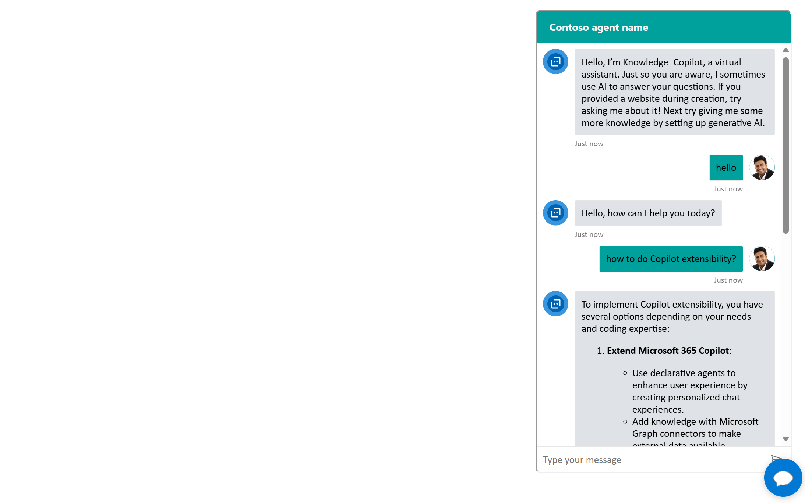
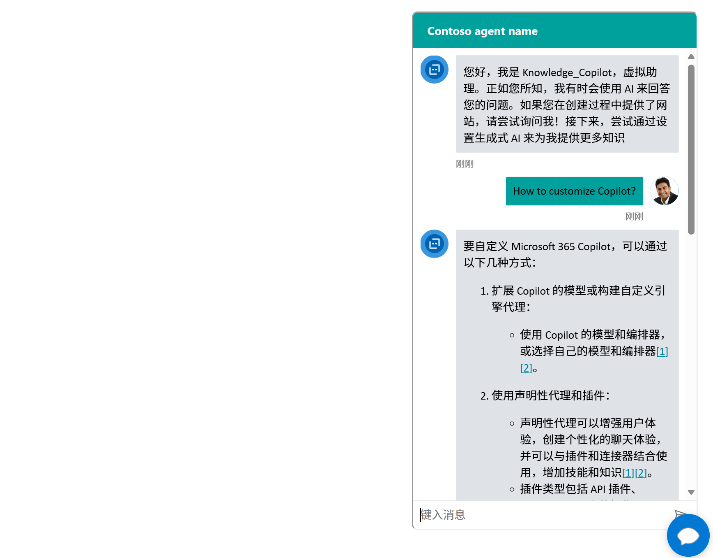
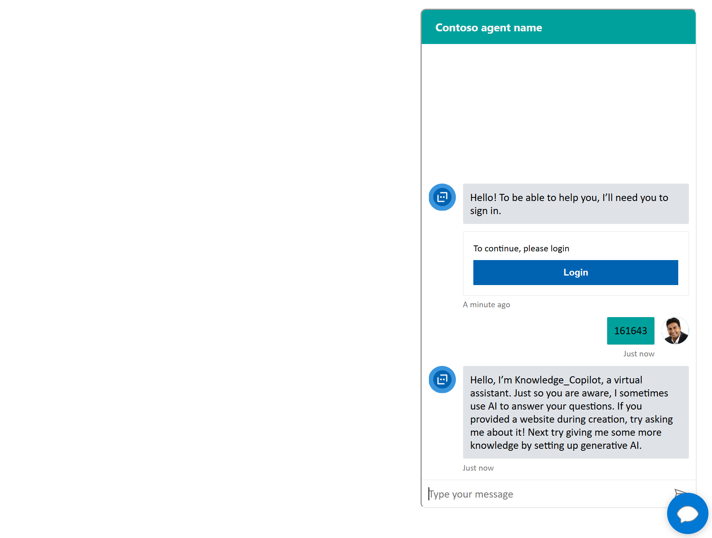

# Web Chatbot Project

This project extends the Microsoft Copilot Studio Agent chat widget that is published on a "web channel/direct channel" to a website so it can provide web based chat interface with a Copilot Agents.  

Note -- this is not the same as an agent connected to Microsot 365 Teams or other interfaces -- this is designed for external authenticed or anonymous users.  

The main enhancements are:

1. Make Chat UI be a bubble icon which visibility can be togglled at the bottom right corner. (Web Channel)
2. Customized font, colors and avatar inside Chat UI. (Direct Line channel, reuqires Dynamic Token Generation)
3. Support multiple languages (Leverage browser language settings)
4. Use SSO (Single Sign On) to secure the communications channel

## Project Structure

```
web-chatbot-project
├── src
│   ├── index.html        # Main HTML document
|   |── agent.html        # Custom Copilot Canvas HTML
│   ├── styles
│   │   └── styles.css    # CSS styles for the webpage
│   └── scripts
│       └── app.js        # JavaScript functionality for the chatbot
└── README.md             # Project documentation
```

## How each enhancement works

### 1. Make Chat UI be a bubble icon which visibility can be togglled at the bottom right corner

a. Clone the repository to your local machine.
b. Navigate to the project directory.
c. Get the agent web channel endpoint based on:

   https://learn.microsoft.com/en-us/microsoft-copilot-studio/publication-connect-bot-to-web-channels
   
d. Edit `src/index.html`, change "./agent.html" to yours web channel endpoint. 


### 2. Customize message bubble font, color, avatars



a. Get Secret based on this official product document for Dynamic Token Generation:

   https://learn.microsoft.com/en-us/microsoft-copilot-studio/configure-web-security#enable-or-disable-web-channel-security

b. Edit `src/agent_auth.html`, change "MY_TEST_SECRET" to the Secret value.

IMPORTANT: The logic of using MY_TEST_SECRET to get [conversationId, token, expires_in] should happen on server side. For security purpose, the Secret info should not be exposed on client side. This client script used here is only for demo purpose.

c. To customize message bubble font or color, modify below code in agent_auth.html

```
.webchat__text-content {
        font-family: Roboto, sans-serif;
        background-color: #DFE3E8;
       }

       .webchat__bubble--from-user .webchat__text-content {
        background-color: #00a19c;
       }
```

d. To customize avatars, modify styleOptions in agent_auth.html

```
  const styleOptions = {
           // Hide upload button.
           hideUploadButton: true,
           accent: '#00809d',
            botAvatarBackgroundColor: '#FFFFFF',
            botAvatarImage: 'https://learn.microsoft.com/azure/bot-service/v4sdk/media/logo_bot.svg',
            botAvatarInitials: 'BT',
            userAvatarImage: 'https://avatars.githubusercontent.com/u/661465',
            userAvatarInitials: 'WC'

         };
```

e. Open `src/index_auth.html` in a web browser to view the project.

### 3. Multiple Languages Support

Follow this guide firstly:
https://learn.microsoft.com/en-us/microsoft-copilot-studio/multilingual

And in agent.html or agent_auth.html, ensure the local variable is set to Browser language properly. In this sample, it is set by default:

```
document.documentElement.lang = navigator.language ;

const locale = document.documentElement.lang || 'en';
```




#### 4 For authenticated users:  Use Authentication inside Agent in Web Channel

Follow below two document guides:

https://learn.microsoft.com/en-us/microsoft-copilot-studio/configuration-authentication-azure-ad

https://learn.microsoft.com/en-us/microsoft-copilot-studio/configuration-end-user-authentication#authenticate-manually





### 5. Use Dedicated token for the web chat widget (this method is deprecated from Copilot Studio Channel Setting) 

Get Dedicated Token from URL:

1. Clone the repository to your local machine.
2. Navigate to the project directory.
3. Get the token endpoint URL based on this official product document (steps 1~3):
    
   https://learn.microsoft.com/en-us/microsoft-copilot-studio/customize-default-canvas?tabs=web#retrieve-token-endpoint

4. Edit `src/agent.html`, change "Copilot_Studio_app_web_endpoint" to the real token URL.
5. Open `src/index.html` in a web browser to view the project.


## Usage

- The chatbot is embedded in the right corner of the webpage.
- Click the bubble icon to toggle the visibility of the chatbot.

## Technologies Used

- HTML
- CSS
- JavaScript

## License

This project is licensed under the MIT License.
