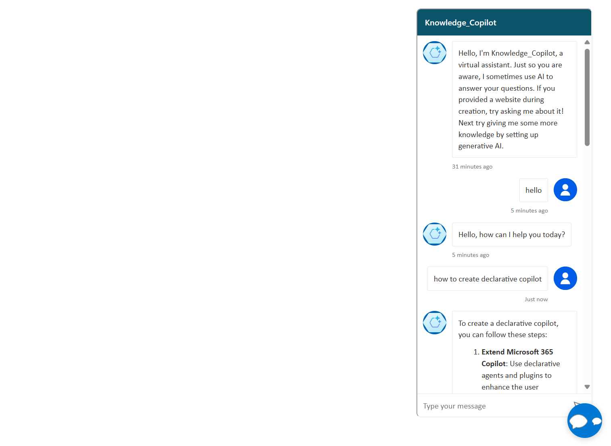

# Web Chatbot Project

This project implements a simple web page that embeds a chatbot in the right corner, featuring a bubble icon to toggle its visibility.



## Project Structure

```
web-chatbot-project
├── src
│   ├── index.html        # Main HTML document
|   |── agent.html        # Custom Copilot Canvas HTML
│   ├── styles
│   │   └── styles.css    # CSS styles for the webpage
│   └── scripts
│       └── app.js        # JavaScript functionality for the chatbot
└── README.md             # Project documentation
```

## Setup Instructions

1. Clone the repository to your local machine.
2. Navigate to the project directory.
3. Get the token endpoint URL based on this official product document (steps 1~3):
    
   https://learn.microsoft.com/en-us/microsoft-copilot-studio/customize-default-canvas?tabs=web#retrieve-token-endpoint

4. Edit `src/agent.html`, change "Copilot_Studio_app_web_endpoint" to the real token URL.
5. Open `src/index.html` in a web browser to view the project.
6. To customize message bubble font or color, modify below code in agent.html

```
.webchat__text-content {
        font-family: Roboto, sans-serif;
        background-color: #DFE3E8;
       }

       .webchat__bubble--from-user .webchat__text-content {
        background-color: #00a19c;
       }
```

## Usage

- The chatbot is embedded in the right corner of the webpage.
- Click the bubble icon to toggle the visibility of the chatbot.

## Technologies Used

- HTML
- CSS
- JavaScript

## License

This project is licensed under the MIT License.